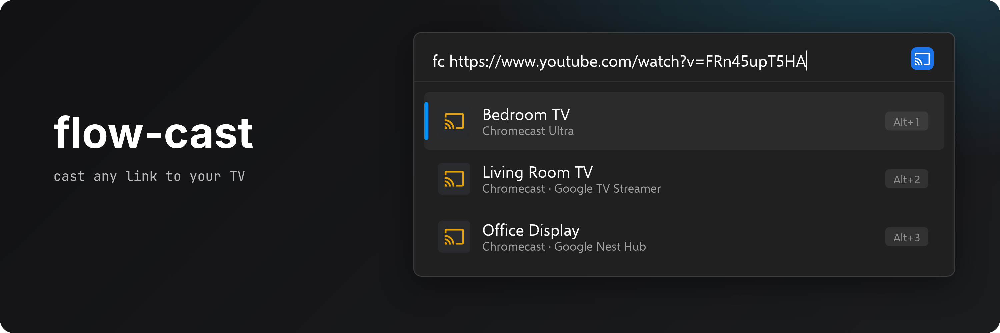

<!-- generated by readwright from docs/README.md.j2; edit the template, not this file -->


# flow-cast

Cast YouTube videos, media links and web videos to a Chromecast from Flow Launcher.

[](https://github.com/Garulf/flow-cast/actions/workflows/tests.yml) [](https://github.com/Garulf/flow-cast/releases/latest) [](https://github.com/Garulf/flow-cast/releases/latest)

[](https://www.buymeacoffee.com/garulf) [](https://github.com/sponsors/Garulf)

## Features

* **Paste a link, pick a TV.** Every Chromecast and Google TV on your network shows up on its own.
* **YouTube in the YouTube app.** YouTube links open in the TV's own YouTube app, playlists included.
* **Media files.** Links to `.mp4`, `.webm`, `.m3u8`, `.mp3` and other media play straight away. Speakers show up for audio.
* **Most video sites.** Anything else goes through [yt-dlp](https://github.com/yt-dlp/yt-dlp), so many other video sites work too.
* **Clipboard aware.** Copy a link, type `fc`, press `Enter`.

## Usage

Type `fc` followed by a link, then pick a device:

```
fc https://www.youtube.com/watch?v=FRn45upT5HA
```


flow-cast confirms with a notification once the video is on its way.

| Query | Result |
| --- | --- |
| `fc <YouTube link>` | Plays in the YouTube app on the TV |
| `fc <media file link>` | Plays in the Chromecast's built-in player |
| `fc <any other page>` | yt-dlp finds the video, then it plays in the built-in player |
| `fc` | Offers the link on your clipboard |

### Cast from the clipboard

With a link on the clipboard, type just `fc` and press `Enter` to fill it in:


### Limits

The Chromecast downloads the video itself, so pages that need you to be logged in, links that only work
with cookies or a referrer, and DRM-protected video won't play. Files on your PC aren't supported.

## Installation

Download `flow-cast-<version>.zip` from the [latest release](https://github.com/Garulf/flow-cast/releases/latest) and unzip it into
`%appdata%\FlowLauncher\Plugins`, then restart Flow Launcher.

Pre-releases of the next version are published from the open release PR on the
[releases page](https://github.com/Garulf/flow-cast/releases) for testing. Flow Launcher won't offer them as updates.

## Requirements

* Flow Launcher 1.17.0 or newer
* Python 3.11 or newer
* This PC and the Chromecast on the same network

## Changelog

### 0.1.0 (2026-10-05)

#### Features

* cast YouTube to the YouTube app and media to the default receiver ([9bcb99b](https://github.com/Garulf/flow-cast/commit/9bcb99b0316bb91291e5157e46c8a96509cca540))
* classify URLs as YouTube, direct media or web pages ([db0ca0b](https://github.com/Garulf/flow-cast/commit/db0ca0b26106e75d7d949ec38ae012e092281763))
* discover Chromecasts over mDNS ([f796fde](https://github.com/Garulf/flow-cast/commit/f796fde12c2eb37b95d48145661996c0a6bb91b1))
* list Chromecasts for a URL and cast to the selected one ([95d973a](https://github.com/Garulf/flow-cast/commit/95d973ab496649477f6e4eb4b7afbeaa59296149))
* read URLs from the Windows clipboard ([b1b1184](https://github.com/Garulf/flow-cast/commit/b1b118447df0e328fcc68c99b6f977cb0245f58a))
* resolve web pages to a stream URL with yt-dlp ([570d69b](https://github.com/Garulf/flow-cast/commit/570d69b5fe9822917f617cb6d9d9ab231b8ac98c))

#### Bug Fixes

* give every result an action so Flow Launcher does not crash on Enter ([9982683](https://github.com/Garulf/flow-cast/commit/99826831bf2b7b69235f8e3382a270c277bf7119))
* play YouTube playlists and channels in the YouTube app and prefer mp4 when codecs are unknown ([8890602](https://github.com/Garulf/flow-cast/commit/8890602d6d45f3f13ce0229810006cf5e85e4899))

### Changelog

All notable changes to this project are documented here. New entries are generated by [release-please](https://github.com/googleapis/release-please) from [Conventional Commits](https://www.conventionalcommits.org/).

See [CHANGELOG.md](CHANGELOG.md) for the full history.
